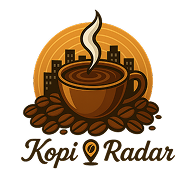

# ☕️ KopiRadar – Infokom Coffee App

 

**KopiRadar** adalah aplikasi mobile resmi dari **Infokom Coffee**, sebuah coffee shop modern yang mendekatkan pelanggan ke pengalaman ngopi yang lebih cerdas dan interaktif. Aplikasi ini menghadirkan fitur pembayaran nontunai, navigasi ke lokasi toko, dan pengalaman pengguna yang intuitif — semua dalam satu genggaman.

---

## 📱 Fitur Unggulan

- 📍 **Lihat Lokasi Coffee Shop** dengan integrasi Google Maps
- 🧭 **Navigasi Langsung** ke Infokom Coffee melalui Google Maps
- 📸 **QRIS Scanner** untuk pembayaran 
- 🔐 **Login & Registrasi** menggunakan Firebase Auth
- 👤 **Manajemen Profil** user
- 📶 **Deteksi Koneksi Internet** (online/offline)
- ⚙️ **State Management** dengan Provider

---

## 🛠️ Teknologi yang Digunakan

| Teknologi            | Keterangan                                 |
|----------------------|---------------------------------------------|
| **Flutter**          | Framework UI multiplatform (Android/iOS)    |
| **Firebase Auth**    | Login & autentikasi pengguna                |
| **Firestore**        | Penyimpanan data transaksi & user          |
| **Provider**         | State management modern & efisien          |
| **Google Maps API**  | Lokasi real-time & navigasi                |
| **QR Code Scanner**  | Pembayaran melalui QRIS scanner            |
| **Connectivity Plus**| Cek koneksi internet secara real-time      |

---

## 🚀 Cara Menjalankan Aplikasi

```bash
git clone https://github.com/ryhndastra/kopiradar.git
cd kopiradar
flutter pub get
flutter run
```

---

## 🖼️ Branding

Nama App: KopiRadar

Nama Bisnis: Infokom Coffee

Identitas: Minimalis, hangat, dan modern

Target: Pengunjung tetap & mahasiswa sekitar

---

## 📂 Struktur Folder

```bash
lib/
├── auth/             # Autentikasi Firebase
├── pages/            # Halaman utama (Home, Scan, Lokasi, Profil)
├── providers/        # Provider untuk state management
├── services/         # Connectivity Service
└── main.dart         # Entry point aplikasi
```

---

## 📄 Lisensi
MIT License © 2025 [Reyhand]

Dibuat dengan ❤️ untuk menghadirkan pengalaman ngopi yang praktis dan modern di Infokom Coffee. Nikmati secangkir kopi, cukup scan dan santai.
